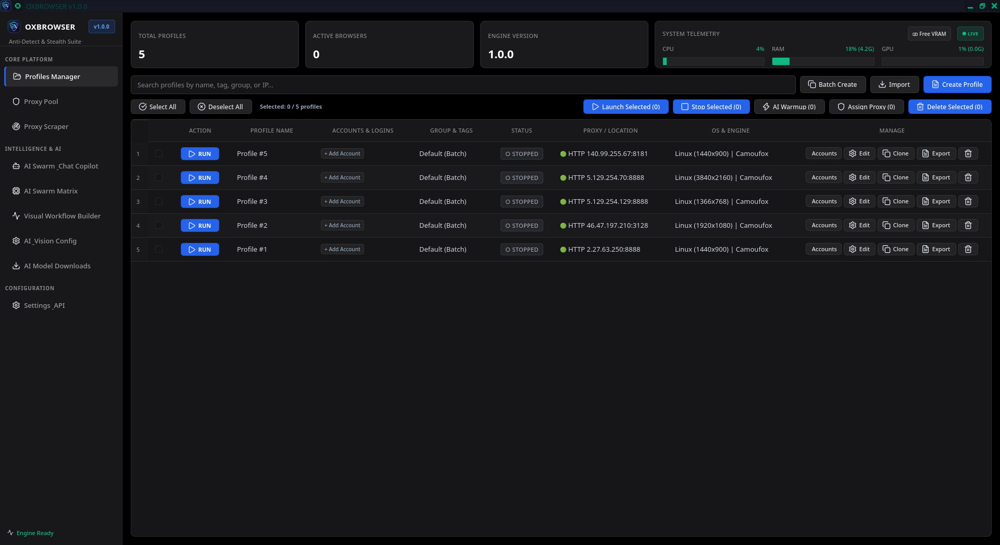
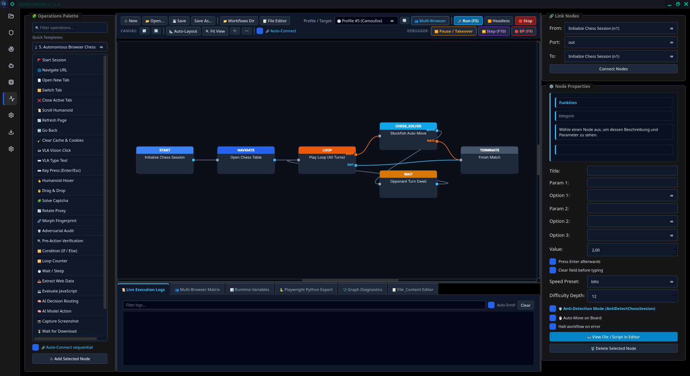
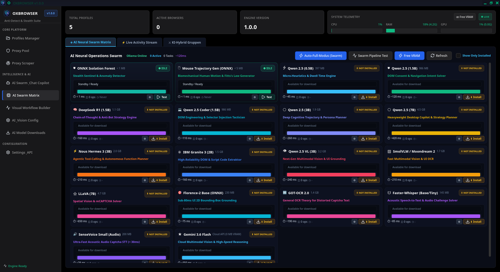

# OXBROWSER v1.0.0

[](https://www.python.org/)
[](https://riverbankcomputing.com/software/pyqt/)
[](https://github.com/fzer0x/OX_REL)
[](https://cryptography.io/)
[](LICENSE)
[](https://github.com/fzer0x/OX_REL)

> **OXBROWSER** is an enterprise-grade, multi-engine anti-detect browser, fingerprint randomization platform, and autonomous AI swarm automation suite. Engineered for high-stealth web data extraction, multi-account orchestration, automated bot-defense evasion, and visual DAG workflow execution.

---

## 📸 User Interface & Screenshots

<div align="center">

### 1. Profiles Manager & Stealth Fleet Dashboard

*Centralized management for multi-engine anti-detect profiles, live proxy routing, accounts & auto-login, and real-time system telemetry.*

<br/>

### 2. Visual Node-Based Workflow Builder (DAG Automation)

*Interactive visual automation canvas with anti-detection nodes, dynamic AI decision branches, humanoid pacing, and live step-by-step debugging.*

<br/>

### 3. Multimodal AI Neural Operations Swarm Matrix

*Decentralized neural operations matrix orchestrating vision grounding (SmolVLM, Florence-2), local LLMs (DeepSeek R1, Qwen 2.5), and ONNX behavioral generators.*

</div>

---

## Table of Contents

- [User Interface & Screenshots](#-user-interface--screenshots)
- [Key Architecture & Core Features](#key-architecture--core-features)
  - [1. Multi-Engine Browser Core](#1-multi-engine-browser-core)
  - [2. Deep Fingerprint Synthesis & Anti-Detect Shield](#2-deep-fingerprint-synthesis--anti-detect-shield)
  - [3. Hardware & MicroVM Isolation](#3-hardware--microvm-isolation)
  - [4. TLS & Network Layer Impersonation](#4-tls--network-layer-impersonation)
  - [5. Multimodal AI Swarm & Vision Automation](#5-multimodal-ai-swarm--vision-automation)
  - [6. Biomechanical Humanoid Simulation](#6-biomechanical-humanoid-simulation)
  - [7. Self-Healing DOM & Honeypot Defenses](#7-self-healing-dom--honeypot-defenses)
  - [8. Visual Node-Based Workflow Builder (DAG)](#8-visual-node-based-workflow-builder-dag)
  - [9. Zero-Knowledge Cryptography & Storage](#9-zero-knowledge-cryptography--storage)
  - [10. REST API, SSE & WebSocket Automation](#10-rest-api-sse--websocket-automation)
- [Directory Structure](#directory-structure)
- [Installation & Setup](#installation--setup)
  - [Prerequisites](#prerequisites)
  - [Quick Start](#quick-start)
- [Configuration & Environment](#configuration--environment)
- [REST API Reference](#rest-api-reference)
- [Testing & Quality Assurance](#testing--quality-assurance)
- [Security & Ethical Use](#security--ethical-use)
- [License](#license)

---

## Key Architecture & Core Features

```
+-------------------------------------------------------------------------------+
|                           OXBROWSER Desktop UI (PyQt6)                        |
|   Profiles Manager  |  Proxy Pool & Scraper  |  AI Swarm Matrix  |  DAG Builder|
+---------------------------------------+---------------------------------------+
                                        |
+---------------------------------------v---------------------------------------+
|                       Global Lifecycle & REST/WS API Server                   |
|           FastAPI / aiohttp  *  Token Auth  *  SSE Event Stream * CSWSH       |
+---------------------------------------+---------------------------------------+
                                        |
+---------------------------------------v---------------------------------------+
|                                 CORE ENGINES                                  |
|  +--------------------+  +----------------------+  +-----------------------+  |
|  | Camoufox (Firefox) |  | Chromium Playwright  |  | Nodriver / Driverless |  |
|  | C++/Rust Injection |  | CDP Binary Patching  |  | Direct CDP / No-Driver|  |
|  +--------------------+  +----------------------+  +-----------------------+  |
+---------------------------------------+---------------------------------------+
                                        |
+---------------------------------------v---------------------------------------+
|                    STEALTH, DEFENSE & BIOMECHANIC SERVICES                    |
|  * FingerprintGenerator (Canvas/WebGL/Audio/WebGPU/Fonts/Speech/Sensors/DRM)  |
|  * TLS Spoofing (JA3/JA4 via BoringSSL)  * Geo-IP & Locale Alignment Engine   |
|  * Biomechanical Keystroke Dynamics      * Humanoid Bezier Mouse Trajectory   |
|  * AST Anti-Bot Deobfuscator             * Self-Healing DOM Semantic Matcher  |
|  * Honeypot Detector & Decoy Shield      * WAF Vector RAG (SQLite)            |
+---------------------------------------+---------------------------------------+
                                        |
+---------------------------------------v---------------------------------------+
|                      MULTIMODAL AI SWARM & CAPTCHA SOLVER                     |
|  * Local Models: Qwen 2.5 (0.5B-7B), DeepSeek R1 (1.5B), Qwen 2.5 Coder/VL    |
|  * Vision/OCR: Florence-2 (ONNX), GOT-OCR 2.0 (ONNX), LLaVA, SmolVLM, Moondream|
|  * Audio STT: Faster-Whisper (CTranslate2), FunAudioLLM SenseVoice Small (ONNX)|
|  * Cloud Multimodal: Google Gemini API (Flash Lite, 3.8 Flash, 1.5 Pro)       |
|  * AI Councils: Action Council Consensus & Adversarial Risk Verification      |
|  * VRAM Arbiter: Dynamic GPU/RAM Memory Governor & Model Swapping             |
+-------------------------------------------------------------------------------+
```

### 1. Multi-Engine Browser Core
- **Camoufox Engine**: Native, compiled anti-detect browser based on Firefox with C++/Rust internal modifications, bypassing high-entropy canvas/audio fingerprint detectors natively without JavaScript overhead.
- **Chromium / Playwright Engine**: Hardened Chromium with runtime binary patching (`ChromiumBinaryPatcher`) and CDP suppression (`CDPRestrictionMitigator`) to eliminate `navigator.webdriver`, automate flags, and Chrome DevTools Protocol indicators.
- **Nodriver Engine**: Next-generation asynchronous Chrome automation bypassing WebDriver entirely via direct WebSocket protocol hooks.
- **Selenium-Driverless**: Native driverless automation preventing automation leaks at the binary level.

### 2. Deep Fingerprint Synthesis & Anti-Detect Shield
The `FingerprintGenerator` provides complete tensor-aligned operating system and hardware emulation across **Windows**, **macOS**, **Linux**, **Android**, and **iOS**:
- **WebGL & WebGL2**: Realistic OS-aligned unmasked vendor and renderer emulation (NVIDIA GeForce RTX 4090/3060 Direct3D11, Apple Metal M-Series, AMD RADV NAVI, Mesa LLVMpipe, Qualcomm Adreno, ARM Mali).
- **Sub-Pixel Canvas Noise**: Deterministic per-profile cryptographic 2D canvas noise perturbation (`toDataURL`, `getImageData`, `toBlob`).
- **AudioContext & Analyser**: Oscillator frequency response normalization and noise injection in `OfflineAudioContext` and FFT buffer calculations.
- **Font & ClientRects**: Deterministic glyph bounding box perturbation and OS-authentic font family lists.
- **WebGPU Emulation**: Emulates `navigator.gpu`, realistic hardware adapters, features, and limits matching target profiles.
- **SpeechSynthesis & Voices**: OS-aligned synthetic voice catalogs matching the target operating system and locale.
- **Synthetic Media Devices**: Realistic enumeration of `audioinput`, `audiooutput`, and `videoinput` devices with persistent hardware UUIDs.
- **WebRTC Protection**: Modes for `disabled`, `real`, or `altered` (public exit IP spoofing and SDP candidate rewrite to stop internal LAN IP leakage).
- **DRM & EME**: Widevine CDM, FairPlay, and PlayReady encrypted media API responses matching real platforms.
- **WebWorker / ServiceWorker**: Automatic patch propagation across `Worker` and `SharedWorker` contexts.

### 3. Hardware & MicroVM Isolation
Configurable profile-level hardware environments:
- **Sandbox Modes**: `container` (OCI/Docker), `microvm` (Cloud-Hypervisor, Firecracker, QEMU via VirtioFS), or native host.
- **Virtual GPU Drivers**: Configurable Mesa Gallium drivers (`llvmpipe`, `virgl`, `iris`, or native `/dev/dri` passthrough).
- **Network Killswitch**: Prevents direct unproxied network traffic; immediately drops traffic if a proxy disconnects.

### 4. TLS & Network Layer Impersonation
- **BoringSSL / curl_cffi Integration**: Emulates authentic browser TLS handshakes matching real Chrome (120-132), Edge, Safari (17/18), and Firefox (130-152) profiles.
- **JA3 & JA4 Fingerprint Presets**: Precise matching of cipher suites, ALPN protocols (`h2`, `http/1.1`), TLS extensions, supported curves, and signature algorithms.
- **Geo-IP Alignment**: Dynamic pre-flight inspection via `ProxyChecker` automatically aligns profile timezones, geolocation coordinates, and RFC 5646 `Accept-Language` headers to the proxy exit IP.

### 5. Multimodal AI Swarm & Vision Automation
OXBROWSER integrates a local and cloud AI orchestration swarm managed by `AISwarmOrchestrator` and `AIModelManager`:
- **Supported Local Models (via embedded/system Ollama & ONNX)**:
  - **Reasoning**: `deepseek-r1:1.5b` (Chain-of-Thought & anti-bot evasion planning).
  - **DOM Scripting**: `qwen2.5-coder:1.5b` & `granite3-dense:2b`.
  - **Spatial Vision & UI Grounding**: `qwen2.5vl:3b`, `llava:7b`, `smolvlm`, `moondream:v2`.
  - **Dense Grounding & Prompt OCR**: `florence-2-base` (ONNX, ~230MB).
  - **Ultra-Dense Visual OCR**: `got-ocr2` (ONNX, ~1.4GB) and `ddddocr`.
  - **Speech-to-Text (Audio Captchas)**: `faster-whisper` (Base/Tiny/Large-v3-Turbo) and FunAudioLLM `sensevoice-small` (ONNX).
- **Cloud Multimodal API**: Google Gemini (`gemini-flash-lite-latest`, `gemini-3.8-flash`, `gemini-1.5-flash`, `gemini-1.5-pro`).
- **Ensemble Strategies**: `local_only`, `gemini_only`, `hybrid_fallback`, `hybrid_gemini_vision`, and `hybrid_50_50_gemini`.
- **VRAM Arbiter**: Real-time memory governor monitoring GPU VRAM / system RAM; dynamically swaps and unloads idle models.
- **AI Action Council & Adversarial Council**: Dual-stage verification that evaluates risk scores, inspects potential honeypot triggers, and obtains consensus before executing critical browser actions.
- **VLA (Vision-Language-Action)**: Natural-language agentic goals translated directly into screen coordinates and element interactions.

### 6. Biomechanical Humanoid Simulation
- **Keystroke Dynamics**: Physical QWERTY/QWERTZ layout mapping, flight time calculations, key dwell hold times, cognitive pauses for shift/capital characters, Gaussian micro-tremor, and realistic adjacent-key mistyping with backspace correction.
- **Humanoid Mouse Trajectories**: Continuous Bezier curve motion generation, Fitts' law velocity modeling, biological tremor, deceleration curves, and overshooting correction.
- **Cookie Warmup Robot**: Automated browsing sessions visiting categorized seed domains to build authentic browsing history, search caches, and cookie trust.

### 7. Self-Healing DOM & Honeypot Defenses
- **Self-Healing DOM Engine**: When CSS/XPath selectors break due to dynamic class obfuscation or DOM changes, the engine scores candidate elements by ARIA attributes, semantic text, hierarchical structure, and visual bounding boxes to synthesize a new working selector in under 15ms.
- **Honeypot Shield**: Detects hidden decoy links, zero-opacity inputs, CSS off-screen traps, and bot-trap elements before interaction occurs.
- **Anti-Bot AST Deobfuscator**: Live normalization of hex/unicode-obfuscated JavaScript from DataDome, Cloudflare Turnstile, Kasada, and Akamai to identify newly injected client-side probes.
- **Autonomous Game Solvers**: Built-in Stockfish chess solver with anti-cheat humanization (move-time curves, blunder emulation) and Monte Carlo Poker solver with table OCR.

### 8. Visual Node-Based Workflow Builder (DAG)
Automate complex browser flows using the interactive PyQt6 workflow canvas or execute them headlessly:
- **Node Types**:
  - *Lifecycle*: Start, Navigate, New Tab, Switch Tab, Close Tab, Scroll, Refresh, Go Back, Clear Cache.
  - *Humanoid Interaction*: VLA Click, VLA Type, Key Press, Hover, Drag & Drop.
  - *Stealth & Security*: Solve Captcha, Rotate Proxy, Fingerprint Morph, Adversarial Audit, Pre-Action Check.
  - *Logic & Control*: Condition, Loop, Wait, Extract Data, JavaScript Eval, AI Decision, AI Model Task, Screenshot, Download Wait, Terminate.
  - *Game Solvers*: Chess Solver, Poker Solver.
- **MultiWorkflowRunner**: Concurrently executes complex DAG workflows across multiple browser profiles with state isolation and telemetry.

### 9. Zero-Knowledge Cryptography & Storage
- **Argon2id Key Derivation**: High-security memory-hard KDF (`iterations=3`, `memory_cost=65536KB`, `lanes=4`).
- **AES-256-GCM & ChaCha20-Poly1305**: Authenticated encryption for all stored profiles, proxy lists, and credentials.
- **Machine-Local Secrets Vault**: Configuration (`app_config.vault`) is stored encrypted at rest with zero plaintext persistence.
- **Vector Store**: SQLite-backed dense vector memory (`waf_vector_rag.sqlite`) storing known anti-bot heuristics and past challenge solutions.

### 10. REST API, SSE & WebSocket Automation
- **RESTful Endpoints**: Complete lifecycle control of profiles, proxies, AI configurations, and DAG workflows.
- **Realtime Streams**: Server-Sent Events (`/api/v1/events`) and WebSocket (`/api/v1/ws`, `/api/v1/events/ws`) broadcasting browser events, workflow step execution, and system resource metrics.
- **Security Hardening**: Bearer token authentication, refresh token rotation, CSWSH origin verification, and IP brute-force rate limiting.

---

## Directory Structure

```
.
├── api/
│   └── server.py                  # aiohttp REST, SSE & WebSocket automation server
├── camoufox/                      # Bundled Camoufox hardened Firefox browser distribution
├── config.py                      # Core configuration, OS WebGL presets, and hardware constants
├── dev/
│   └── soxbot_backend.py          # Standalone headless backend daemon
├── engine/
│   ├── account_manager.py         # Multi-account session & social identity manager
│   ├── ai_action_council.py       # Multi-agent action consensus & safety evaluation
│   ├── ai_adversarial_council.py  # Adversarial security & honeypot risk auditing
│   ├── ai_agent_actions.py        # High-level humanoid browser interaction primitives
│   ├── ai_captcha_solver.py       # Cloudflare Turnstile, reCAPTCHA, hCaptcha, FunCaptcha solvers
│   ├── ai_chat_engine.py          # Multimodal copilot conversation engine
│   ├── ai_gemini_client.py        # Google Gemini multimodal API client
│   ├── ai_hybrid_groups_manager.py# Custom ensemble and hybrid model group manager
│   ├── ai_inference_optimizer.py  # Quantization & batching optimizer
│   ├── ai_model_config.py         # AI model registry & hyperparameter configuration
│   ├── ai_model_manager.py        # Ollama / ONNX lifecycle & download manager
│   ├── ai_swarm_orchestrator.py   # Multi-agent VRAM arbiter & swarm scheduler
│   ├── ai_telemetry.py            # Real-time event bus & token tracking
│   ├── ai_vla_engine.py           # Vision-Language-Action spatial grounding engine
│   ├── anti_bot_deobfuscator.py   # AST JavaScript string & probe deobfuscator
│   ├── browser.py                 # Core browser launcher (Camoufox, Playwright, Nodriver)
│   ├── cdp_patcher.py             # Chromium binary patcher & CDP stealth injector
│   ├── cookie_manager.py          # Cookie import/export and persistent storage
│   ├── cookie_warmup.py           # Humanoid browsing & cookie warmup robot
│   ├── dom_self_healer.py         # Structural & semantic self-healing DOM selector engine
│   ├── fingerprint.py             # Deterministic fingerprint generation & JS stealth scripts
│   ├── game_solvers/              # Stockfish Chess engine & Poker Monte Carlo solvers
│   ├── geo_ip_aligner.py          # Geolocation, timezone & Accept-Language synchronizer
│   ├── google_proxy_checker.py    # Deep Google search & endpoint proxy health checker
│   ├── honeypot_detector.py       # Traps invisible inputs, zero-opacity & decoy elements
│   ├── keystroke_dynamics.py      # Sub-millisecond biomechanical typing simulation
│   ├── lifecycle.py               # Global process lifecycle & resource governor
│   ├── platform_helper.py         # Cross-platform abstractions (Windows, Linux, macOS)
│   ├── proxy_checker.py           # Asynchronous proxy health and latency tester
│   ├── proxy_scraper.py           # Multi-source proxy crawler and validator
│   ├── proxy_tunnel.py            # Local proxy tunnel adapter with killswitch
│   ├── sandbox/                   # MicroVM & OCI Container isolation engines
│   ├── tls_impersonate.py         # JA3/JA4 TLS fingerprinting via BoringSSL / curl_cffi
│   └── workflow_engine.py         # Visual DAG automation execution engine
├── main.py                        # Desktop application entrypoint (PyQt6 + qasync)
├── models/                        # Pre-trained ONNX models, whisper models, and engines
├── storage/
│   ├── crypto_vault.py            # Zero-knowledge Argon2id + AES-256-GCM crypto vault
│   ├── profile_manager.py         # Profile persistence, cloning, and schema validation
│   ├── proxy_manager.py           # Proxy pool database & credentials
│   ├── secrets_manager.py         # Hardware-keyed encrypted vault for configuration
│   └── vector_store.py            # SQLite-backed WAF vector RAG database
├── tests/                         # Comprehensive automated test suite (60+ tests)
├── ui/                            # PyQt6 dark-themed user interface
│   ├── main_window.py             # Main application window & sidebar navigation
│   ├── theme.py                   # Dark modern stylesheet & design tokens
│   └── views/                     # Views for Profiles, Proxies, Workflows, AI Chat & Settings
└── requirements.txt               # Python package dependencies
```

---

## Installation & Setup

### Prerequisites
- **Python**: `3.12+`
- **Operating System**: Linux (Ubuntu 22.04+, Debian 12+, Arch, Fedora), Windows 10/11, or macOS (Apple Silicon / Intel).
- **Optional Dependencies**:
  - `ollama`: For running local LLMs and VLMs (Qwen 2.5, DeepSeek R1, LLaVA).
  - `docker` / `podman`: For container-isolated sandboxing.

### Quick Start

1. **Clone the Repository**:
   ```bash
   git clone https://github.com/fzer0x/OX_REL.git
   cd OX_REL
   ```

2. **Create and Activate a Virtual Environment**:
   ```bash
   python3 -m venv .venv
   source .venv/bin/activate  # On Windows: .venv\Scriptsctivate
   ```

3. **Install Dependencies**:
   ```bash
   pip install -r requirements.txt
   ```

4. **Install Playwright Browser Binaries**:
   ```bash
   playwright install chromium firefox
   ```

5. **Run the Application**:
   ```bash
   python main.py
   ```

---

## Configuration & Environment

Configuration settings are automatically encrypted in `app_config.vault` via the `SecretsManager`. You can also configure parameters via environment variables:

| Environment Variable | Description | Default |
| :--- | :--- | :--- |
| `SOXBOT_API_HOST` | Host address for the automation REST/WS API | `127.0.0.1` |
| `SOXBOT_API_PORT` | Port for the automation REST/WS API | `59200` |
| `SOXBOT_API_TOKEN` | Bearer token for API authentication (auto-generated if empty) | *Auto-generated* |
| `GEMINI_API_KEY` | Google Gemini API key for cloud multimodal vision & chat | *None* |

---

## REST API Reference

The local REST API starts automatically with the application on `http://127.0.0.1:59200`.

### Authentication
Include the Bearer token in the `Authorization` header:
```http
Authorization: Bearer <SOXBOT_API_TOKEN>
```

### Key Endpoints

| Method | Endpoint | Description |
| :--- | :--- | :--- |
| `GET` | `/api/v1/health` | Service health status and uptime |
| `GET` | `/api/v1/spec` | OpenAPI specification |
| `GET` | `/api/v1/events` | Server-Sent Events (SSE) realtime stream |
| `GET` | `/api/v1/ws` | Full-duplex WebSocket stream |
| `POST` | `/api/v1/auth/login` | Authenticate and obtain JWT access & refresh tokens |
| `GET` | `/api/v1/profiles` | List all browser profiles with runtime statuses |
| `POST` | `/api/v1/profiles/create` | Create a new profile with custom fingerprint settings |
| `POST` | `/api/v1/profiles/batch-create` | Batch create multiple profiles with randomized fingerprints |
| `POST` | `/api/v1/profiles/launch/{id}` | Launch browser profile by ID (Camoufox or Chromium) |
| `POST` | `/api/v1/profiles/stop/{id}` | Stop running profile |
| `POST` | `/api/v1/profiles/warmup/{id}` | Start autonomous cookie warmup routine |
| `GET` | `/api/v1/proxies` | List proxies in pool |
| `POST` | `/api/v1/proxies/import` | Import proxy list (HTTP/SOCKS4/SOCKS5) |
| `POST` | `/api/v1/proxies/scrape` | Trigger multi-source proxy scraper |
| `GET` | `/api/v1/ai/models` | List available local and cloud AI models |
| `POST` | `/api/v1/ai/chat` | Send multimodal prompt to active AI copilot / council |
| `POST` | `/api/v1/ai/vram/clear` | Evict idle models and free GPU VRAM |
| `GET` | `/api/v1/workflows` | List saved DAG automation workflows |
| `POST` | `/api/v1/workflows/run` | Execute a DAG workflow |
| `POST` | `/api/v1/workflows/stop/{id}` | Terminate running workflow execution |
| `GET` | `/api/v1/system/metrics` | Real-time RAM, CPU, VRAM, and active browser metrics |

---

## Testing & Quality Assurance

The codebase includes an extensive suite of automated unit, integration, and forensic tests:

```bash
# Run entire test suite
pytest tests/

# Run forensic anti-detect audit suite
pytest tests/forensic_audit_suite.py

# Run specific subsystem tests
pytest tests/test_fingerprint.py
pytest tests/test_turnstile_solver.py
pytest tests/test_workflow_advanced.py
pytest tests/test_keystroke_dynamics.py
pytest tests/test_dom_self_healing.py
```

---

## Security & Ethical Use

> [!CAUTION]
> **OXBROWSER** is provided strictly for authorized security research, software quality assurance, web compatibility testing, and legitimate web automation. Users are responsible for complying with all applicable laws, regulations, and website terms of service. The developers assume no liability for misuse.

---

## License

Distributed under the **MIT License**. See [`LICENSE`](LICENSE) for full details.

Copyright (c) 2026 fzer0x.
